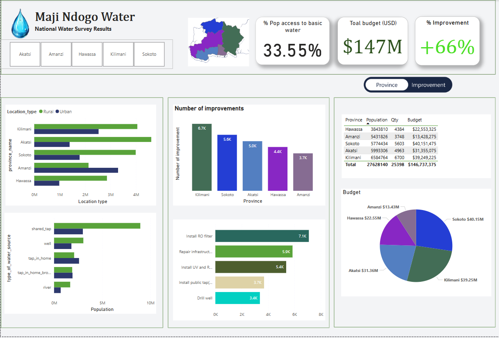

# Maji_Ndodgo_Project: Data-Driven-Solutions-for-Water-Access-and-Transparency

This Project is aimed at improving water access, optimizing resource allocation, and enhancing financial transparency. By leveraging AI, data analytics, and visualization tools, the project provides insights into infrastructure improvements, tracks funding usage, and ensures equitable water distribution. With an emphasis on community impact and accountability, this project empowers both policymakers and the public with real-time data to drive meaningful change.

## Project Overview

The analysis is centred on the following

- Monitoring project progress through interactive visualizations at national, provincial, and town levels.
- Ensuring financial accountability by tracking expenditures, comparing actual spending with the budget, and analyzing cost variations.
- Assessing impact by measuring improvements in water accessibility and estimating the number of beneficiaries.
- Support decision-making with data-driven insights that help prioritize interventions and optimize resource allocation.

## Database Structure

The project uses the following tables:

- **`queue_composition`**: Records the percentage of males, females, or children present in the queue during each site visit.
- **`visits`**: Logs water source visits, including queue times, assigned personnel, and the date and time of each visit.
- **`water_source`**: Stores details about the source type and the population it serves.
- **`well_pollution`**: Records contamination levels in well water.
- **`project_progress`**: Tracks improvement efforts, their status, and related comments.
- **`infrastructure_cost`**: Contains details on the estimated cost of each improvement.
- **`vendors`**: Stores information about vendors contracted to implement improvements, including company name and type.
- **`location`**: Contains geographic data such as town, province, and address.

## Key Features

1. **Project Progress Tracking**
-  Visual Map: Shows completed, ongoing, and pending water infrastructure improvements at national, provincial, and town levels.
-  Project Completion Percentage: Displays the overall percentage of completed water infrastructure projects.
-  Number of Water Sources Improved: Tracks the number of sources upgraded and their impact.
2. **Financial Transparency & Budget Monitoring**
-  Total Expenditure vs. Budget: Compares actual spending to the allocated budget using KPI visuals.
-  Breakdown of Spending: Categorizes expenses by location, project type, and vendor.
-  Cost Forecasting: Predicts whether the allocated budget is sufficient and identifies potential cost reductions.
-  Vendor Cost Analysis: Compares costs of different vendors to detect high-cost outliers.
3. **Impact Analysis**
-  Basic Water Access Metrics: Measures improvements in water accessibility before and after project implementation.
-  Affected Population Count: Estimates the number of people benefiting from the improved water sources.
-  Urban vs. Rural Cost Analysis: Highlights cost differences between urban and rural infrastructure projects.
4. **User-Centric Insights**
-  Public Dashboard: Allows citizens to see project progress, spending, and impact in their communities.
-  Decision-Maker Dashboard: Provides granular details for policymakers on budget performance, resource allocation, and project prioritization.
-  Filter & Drill-Down Features: Enables users to analyze data by province, town, improvement type, and vendor.

## How to Run the Project

1. Load Data – Import `Md_water_services_data.xlsx` into Power BI and update the dataset.
2. Create and Align Relationship Mode – Realign relationship to make a Star Schema 
3. Prepare Dashboard – Open Public_dashboard.pbix, clean unnecessary data, and refresh sources.
4. Analyze Progress – Track project completion, water access improvements, and affected populations.
5. Monitor Budget – Compare actual vs. budgeted costs, identify high-cost vendors, and forecast expenses.
6. Generate Insights – Provide real-time reports for decision-makers and the public.
7. Publish & Optimize – Finalize formatting, ensure interactivity, and deploy the dashboard.

## Access the Full Documentation

Dataset was provided by ALX [project documentation](https://alx.com).
